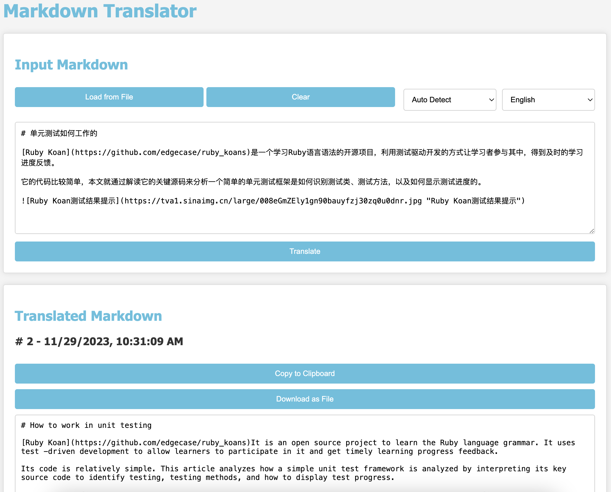

*(This essay is translated from [en](README.en.md "Original Essay Link"))*

[English](README.en.md) |[简体中文](README.zh-cn.md)|[繁体中文](README.zh-tw.md)

# md-翻译

翻译 markdown 文件，例如从`en`到`zh-CN` 。代码块不会被翻译。

## 如何使用？

对于大多数用户来说，无需任何编程知识，您就可以打开网页[mdtranslator.haroldgao.com](https://mdtranslator.haroldgao.com/)来翻译您的 Markdown 内容。

对于专业用户，您可以使用 python 脚本来创建自己的脚本。我的个人网站[haroldgao.com](https://haroldgao.com)使用这个 python 版本将我的博客翻译成不同的语言。

###  1 翻译网页中的markdown内容

[mdtranslator.haroldgao.com](https://mdtranslator.haroldgao.com/) ：



###  2 在终端上运行Python脚本

1. 获取[translate.py](src/python/translate.py)文件并安装所有依赖库：
```bash
git clone https://github.com/xiangaoole/md-translate.git md_translate
cd md_translate
pip3 install python-frontmatter markdown2 markdownify translators google-cloud-translate
```
2. 通过`python3 src/python/translate.py {md_file_path|md_dir_path}`运行 python 代码

默认 python 配置使用`Translator.FREE` ，这取决于`translators`库。它是一个免费的非官方谷歌翻译库。如果您想使用更准确的 Google 翻译服务，您应该配置自己的[云翻译身份验证](https://cloud.google.com/translate/docs/authentication)并更改 python 脚本中的配置部分。

###  3 在你自己的python脚本中使用python模块

1. 获取[translate.py](src/python/translate.py)文件并安装所有依赖库：
```bash
git clone https://github.com/xiangaoole/md-translate.git md_translate
# All the libs are only tested on python3.9
pip3 install python-frontmatter markdown2 markdownify translators google-cloud-translate
```
2. 在 python 脚本中导入 python 模块：
```python
from md_translate.src.python.translate import translate_content

translation = translate_content(md_text, source_lang, target_lang)
print(f"Translated text: {translation}")
```

## 它是如何工作的？

 Markdown 有一些特定的标记，可能会被错误翻译。因此，此翻译的工作原理是将 markdown 转换为 html，并使用 Google Translate API 翻译 html 内容。